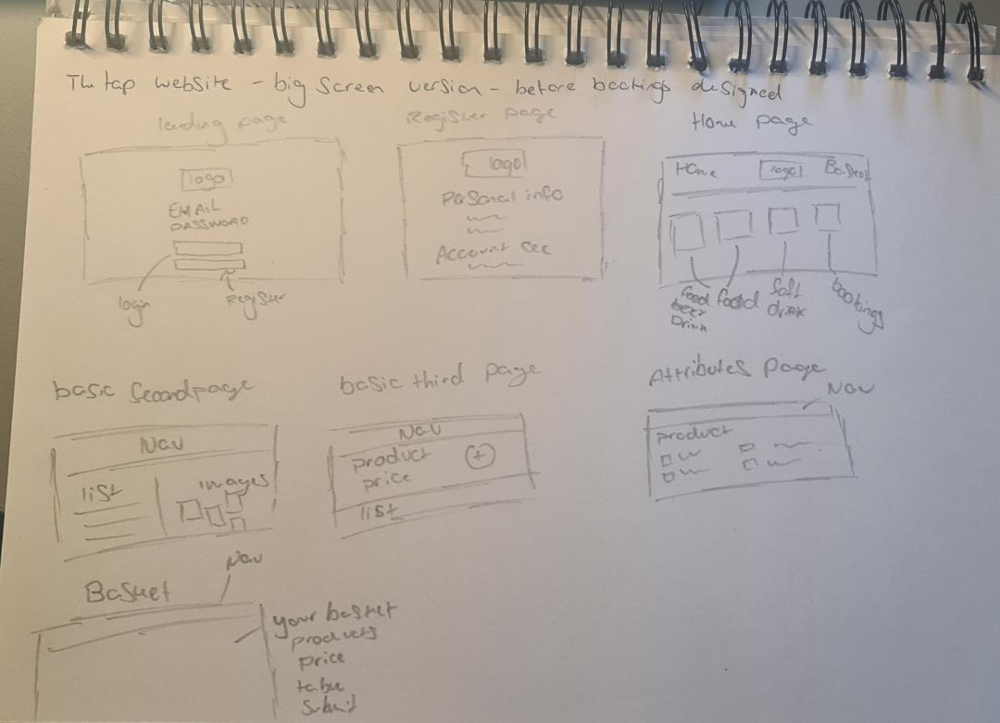
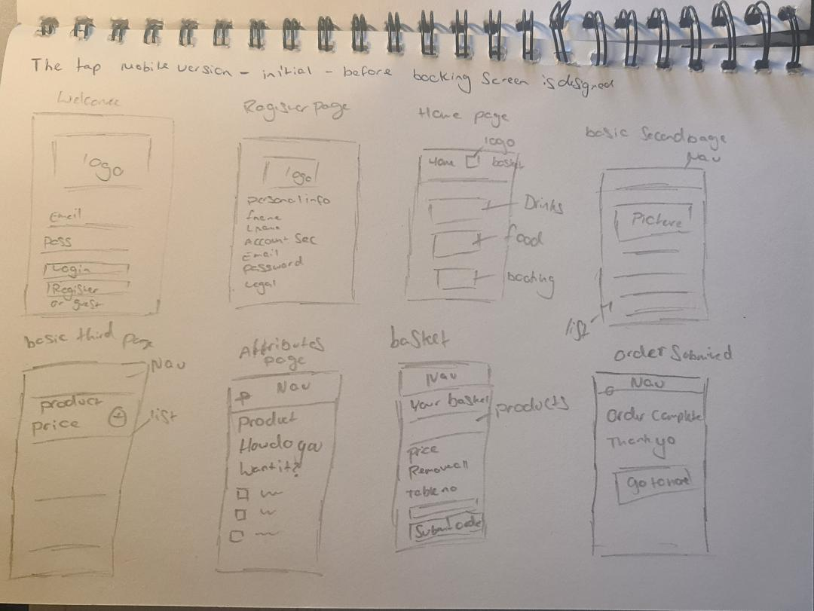

# The Tap

## Introduction
The Tap is a made up pub. This website will be a table service which also has a room booking service.  

## Table of contents
* [User Goals](#User-Goals)
* [Features](#Features)
* [Technology](#Technology)
* [Testing](#Testing)
* [Deployment](#Deployment)
* [Credits](#Credits)
* [Screenshots](#Screenshots)

# User Goals
## All user goals
-
-
-

## Returning user goals
-
-
-

## Website owner goals
-
-
-

[Back to Table of contents](#table-of-contents)

# Features
## Wireframes
I have decided to draw out my wireframes. I wanted to keep the design simple and clean.
### Computer version

### Mobile Version

[Back to Table of contents](#table-of-contents)

# Technology

[Back to Table of contents](#table-of-contents)

# Testing

[Back to Table of contents](#table-of-contents)

# Deployment

[Back to Table of contents](#table-of-contents)

# Credits

[Back to Table of contents](#table-of-contents)

# Screenshots

[Back to Table of contents](#table-of-contents)